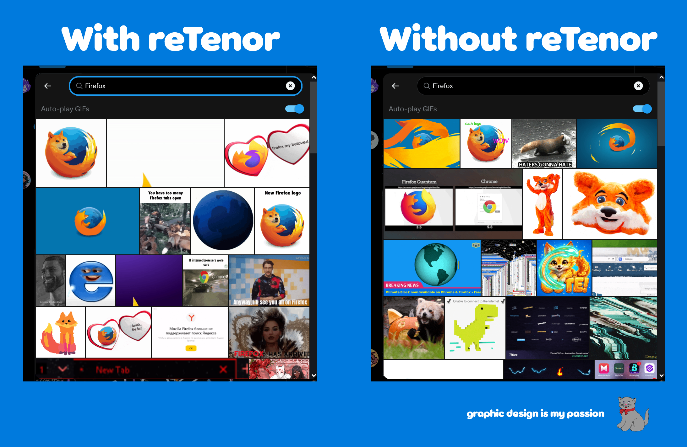

# reTenor for Twitter

This extension replaces Twitter's GIF search with results from Tenor. Tenor is shutting down their API on June 30th, 2026, so Twitter will no longer be able to search for GIFs on Tenor. This extension will restore that functionality by using the mobile API since [Google has stated the app will still work](https://support.google.com/tenor/answer/10455265#zippy=%2Chow-will-this-affect-users).

Please open an issue for any bugs

I have a similar project for Vencord called [tenorGifSearch](https://github.com/Lunascaped/tenorGifSearch)

Icon made by [BlobMedia](https://youtube.com/@blob8556)

## For Installation

### Chrome
1. Install the extension from [the Chrome Web Store.](https://chromewebstore.google.com/detail/retenor/ljbgbggcgplnjehnjjhbpgajdjaejoml)
2. Have fun!

### Firefox

1. Install the extension from [the Firefox Addon Store.](https://addons.mozilla.org/en-US/firefox/addon/retenor/)
2. Have fun!

### Please leave a star :)

Follow me on twitter: [@Lunascaped](https://twitter.com/Lunascaped)

Please go to [gaq9.com](https://gaq9.com)
